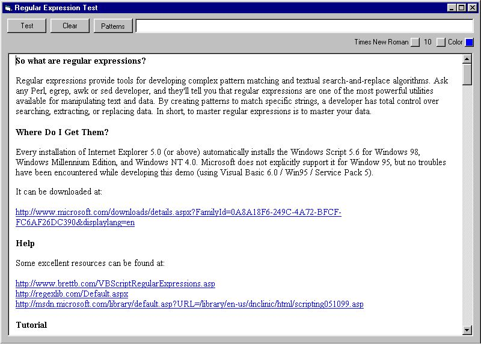

<div align="center">

## Using Regular Expressions


</div>

### Description

Regular Expressions is a very powerful tool for string manipulations. I have developed an inhouse tool to to test and optimize pattern code. A tutorial is included that will get the new user "up to speed" in seconds!
 
### More Info
 
This code requires VB6.0 and the richtextbox. It will work on Windows95/98/Nt/XP


<span>             |<span>
---                |---
**Submitted On**   |2003-10-03 15:56:52
**By**             |[Ed Porter](https://github.com/Planet-Source-Code/PSCIndex/blob/master/ByAuthor/ed-porter.md)
**Level**          |Intermediate
**User Rating**    |5.0 (30 globes from 6 users)
**Compatibility**  |VB 6\.0
**Category**       |[String Manipulation](https://github.com/Planet-Source-Code/PSCIndex/blob/master/ByCategory/string-manipulation__1-5.md)
**World**          |[Visual Basic](https://github.com/Planet-Source-Code/PSCIndex/blob/master/ByWorld/visual-basic.md)
**Archive File**   |[Using\_Regu1653521032003\.zip](https://github.com/Planet-Source-Code/ed-porter-using-regular-expressions__1-48980/archive/master.zip)

### API Declarations

```
Private Declare Function ClientToScreen Lib "user32" _
(ByVal hWnd As Long, lpPoint As Any) As Long ' lpPoint As POINTAPI) As Long
Private Declare Function LBItemFromPt Lib "comctl32.dll" _
(ByVal hLB As Long, ByVal ptX As Long, ByVal ptY As Long, _
ByVal bAutoScroll As Long) As Long
Private Declare Function SendMessage Lib "user32" Alias "SendMessageA" _
(ByVal hWnd As Long, ByVal wMsg As Long, ByVal wParam As Long, _
lParam As Any) As Long  ' <---
Private Declare Sub GetSystemTime Lib "kernel32" (lpSystemTime As SYSTEMTIME)
Private Type POINTAPI  ' pt
 X As Long
 Y As Long
End Type
Private Type SYSTEMTIME
    wYear As Integer
    wMonth As Integer
    wDayOfWeek As Integer
    wDay As Integer
    wHour As Integer
    wMinute As Integer
    wSecond As Integer
    wMilliseconds As Integer
End Type
Private Const WM_SETREDRAW = &HB
```


